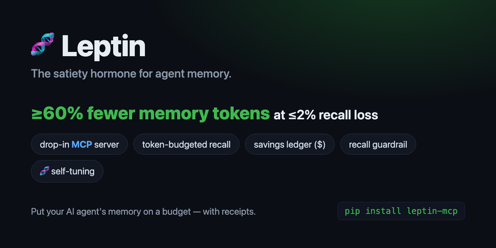

<div align="center">



# 🧬 Leptin

### Token-budgeted MCP memory for AI coding agents.

**The satiety hormone for agent memory:** a drop-in [MCP](https://modelcontextprotocol.io) server that puts your AI agent's long-term memory on a token budget, shows you the receipts, and guarantees it never silently forgot anything that mattered.

[](https://github.com/lionellau/leptin/actions/workflows/ci.yml)
[](https://pypi.org/project/leptin-mcp/)
[](#install)
[](#design)
[](#testing)
[](#the-headline-reproduce-it-yourself)
[](LICENSE)

[Quickstart](#quickstart) · [Why I built this](#why-i-built-this) · [How it works](#how-it-works) · [Who it's for](#who-leptin-is-for) · [Benchmark](#the-headline-reproduce-it-yourself) · [Self-tuning](#-self-tuning--leptin-learns-its-own-diet) · [Security](#security)


</div>

---

Persistent-memory MCP servers fixed *"the agent forgets between sessions."* But for many setups they introduce a quieter problem: **the memory store can inflate every prompt and bill you for it.** As the store grows, a top-k `recall` tends to inject more matched memories into context — eating the very window it was meant to protect — and it's often hard to see what that's costing. Turning on forgetting helps, but a plain decay scanner can drop a fact you'll want next week with no easy way to check or undo it.

Plenty of good tools address pieces of this. **Leptin's bet is to put the whole loop — diet + scale + safety net — into one lean, local sidecar.** Like the hormone it's named after, it tells your memory store when it's had enough, so it stops hoarding.

```
  A memory layer can quietly grow forever and bill you in the dark,
  or forget things and hope you don't notice.

  Leptin puts your memory on a budget, shows you the receipts,
  and proves it didn't forget anything that mattered.
```

**Best for** agents whose memory *grows over time* — long-running / spec-driven coding, long-horizon research, and autonomous or scheduled agents. Doing one-off Q&A or daily ops? You probably don't need it. ([who it's for, and who isn't ↓](#who-leptin-is-for))

---

## Why I built this

> *(The origin story — the "why" behind the code.)*

I build with AI coding agents every day, so I add a memory MCP server to stop re-teaching my agent the same stack, preferences, and decisions each session.

Two things started bothering me as the store grew. First, **`recall` quality rotted.** A store accumulates duplicates, restatements, and stale or contradictory facts, so when the agent *did* call `recall` it got back a bloated, noisy blob — and because a tool result stays in the conversation, that blob then rode along for the rest of the session. (To be precise: MCP memory is *pull* — the model calls `recall` when it wants it, it is not auto-injected every turn. But a fat, junky recall is real, and it lingers.) Second, **I had no visibility or control:** no ceiling on how big a recall could get, no number on what it cost, and the layers that prune did it blindly — I couldn't see what was dropped or get it back.

The agent-memory space is good and moving fast; several tools already do parts of this well. I just wanted one small, **local-first** piece that did four things together, for how I actually work (a solo dev on a local SQLite store I'd rather not migrate off of):

1. keep the store **lean** automatically (dedup / merge / decay) so recall stays clean;
2. **cap and pack** what `recall` returns under a token budget;
3. **show me the numbers** — tokens and dollars, on my own data;
4. turn on **forgetting without fear** — every prune checked and reversible.

So I built Leptin to scratch that itch. It is not trying to replace the bigger memory platforms; it is the lean sidecar I wanted.

**Honest scope (so I don't oversell it):** the win is a *smaller, cleaner `recall` payload* — the benchmark measures exactly that (~60% vs a naive top-k dump) — plus a store that doesn't rot. It is **not** "saves you on every prompt." With prompt caching, re-sent history is already discounted; Leptin's job is to make the part you *do* inject smaller and keep it from filling with junk. The one fixed cost Leptin adds is its tool definitions in each request (they sit in the cached prefix); a lean tool-surface mode for setups where that matters is on the roadmap.

*— [@lionellau](https://github.com/lionellau). PRs, issues, and "this saved me X tokens" stories welcome.*

---

## The headline (reproduce it yourself)

```bash
leptin bench
```

```
  Leptin benchmark — naive top-k store vs. Leptin (offline, deterministic)
  ----------------------------------------------------------------
  corpus            : 49 inserts, 24 probes
  active memories   : naive   47   leptin   39   (dedup kept 8 out)
  recall budget     : 1500 tokens   |   naive dumps top-10
  ----------------------------------------------------------------
  memory tokens     : naive   3396   leptin   1147
  TOKEN REDUCTION   : 66.2%   (target ≥ 60%)
  recall            : naive 1.000   leptin 1.000
  RECALL LOSS       : 0.0%   (target ≤ 2%)
  est. $ saved      : $0.006966  (priced at claude-sonnet-4-6)
  ----------------------------------------------------------------
  HEADLINE          : PASS ✅  ≥60% fewer memory tokens at ≤2% recall loss
```

> **≥60% fewer memory tokens at ≤2% recall loss** — runs fully offline, no API key, deterministic. The corpus, prompts, and models are pinned in code so the number is the same on your machine as on ours.

<details>
<summary><b>About this benchmark — what it does and doesn't show</b></summary>

- **The baseline is a naive top-k dump** — exactly what stock persistent-memory MCP servers do today. That's the real status quo Leptin competes against, not a strawman.
- **Savings come from two real mechanisms:** mostly *budgeted, relevance-packed recall*, plus *write-time dedup/merge*. The output shows the dedup contribution separately (`dedup kept N out`).
- **The corpus is synthetic and illustrative** — a bundled, deterministic LoCoMo-style set. To measure your own numbers on real [LoCoMo](https://snap-research.github.io/locomo/) with hosted embeddings: `leptin bench --dataset locomo.json --embedding-model text-embedding-3-small`.

</details>

---

## Quickstart

### 1. Install

```bash
pip install leptin-mcp                 # once published to PyPI
uvx leptin-mcp serve                   # zero-install run (uv)

# from source today:
pip install "git+https://github.com/lionellau/leptin"

# optional: hosted embeddings + LLM merge (OpenAI / Voyage / Claude)
pip install "leptin-mcp[hosted]"
```

### 2. Connect it to Claude Code / Codex

```bash
leptin init
```

That prints a ready-to-paste MCP config block:

```jsonc
{
  "mcpServers": {
    "leptin": { "command": "leptin", "args": ["serve", "--db", "~/.leptin/memory.db"] }
  }
}
```

Restart the client. The agent now has 8 memory tools. Ask it to *"remember that I prefer dark mode"*, then later *"what are my preferences?"* — and run `leptin report` to see the tokens and dollars saved.

> Savings show up once your store has overlap (so dedup fires) or recall hits the budget. On a brand-new store, `report` honestly says it hasn't saved anything *yet*.

### 3. See the receipts

```bash
leptin dashboard      # local savings dashboard at http://127.0.0.1:8765
leptin doctor         # health check: store, schema, models, hosted readiness
leptin report         # or print the ledger as JSON
```

<div align="center">

</div>

---

## How it works

<div align="center">

</div>

Five mechanisms, all behind the MCP interface:

1. **Write-time dedup / merge.** On `remember`, near-duplicates within a subject are merged into one canonical memory; contradictions supersede the older fact. The store stops accumulating restatements.
2. **Time-decay forgetting.** Each memory has a `strength` that decays exponentially (Ebbinghaus-style, configurable half-life) and is boosted on access. Weak, unused memories become prune-eligible.
3. **Budgeted, packed recall.** Candidates ranked by `similarity × strength`, then greedy-packed under a hard token budget with a relevance gate — so off-topic padding never makes the cut.
4. **Savings ledger.** Every op logs `baseline_tokens` (what a naive store would have injected) vs. `actual_tokens`, converted to $ via a per-model price table.
5. **Recall guardrail.** Before any prune commits, a probe set (`question → expected_fact`) is re-run against the post-diet store *inside a transaction*; if recall would drop past a threshold, the whole prune is **rolled back**.

### The theory, and why it matters for your projects

**Context windows are a budget, and memory spends it silently.** Every token a memory layer injects is a token your agent can't use for code, and a token you pay for on every turn. The naive design — *embed the query, return the top-k matches, inject all of them* — has a brutal failure mode: as the store grows, "top-k" is drawn from an ever-larger pool, so the matches get bigger and less precise, and you re-pay for them on **every** recall.

Concretely, the kind of thing that bites real projects:

- **A months-long coding project.** By month three your agent has "remembered" hundreds of overlapping facts about the codebase. A single *"how does auth work?"* recall now injects 2–3k tokens of half-relevant history every turn. Multiply by hundreds of turns a day. Leptin's dedup collapses the restatements and its budgeted recall injects only the on-topic few — the cost stops growing with the store.
- **Preferences and decisions that change.** You said "use pnpm" in week one and "actually, use bun" in week six. A naive store now holds both and may inject the stale one. Leptin's *supersede* keeps the newer fact active and the older one auditable-but-out-of-context.
- **Multi-agent / multi-session setups.** Several agents hammering one memory store re-inject the same boilerplate constantly. Dedup + a token ceiling caps the blast radius.
- **"Just turn on forgetting."** Decay alone is dangerous — the fact you query once a month is exactly the one a dumb decay scanner deletes. Leptin only prunes behind the **recall guardrail**, and quarantines (never hard-deletes) within a retention window, so forgetting is safe and reversible.

The decay model is the classic **Ebbinghaus forgetting curve** (`strength(t) = strength₀ · e^(−λt)`, reinforced on access) — the same spacing-and-recency intuition human memory uses, applied to keep the *useful* facts strong and let genuinely-cold ones fade. The budgeted packer is a greedy knapsack on relevance-per-token. The recall guardrail is the piece I most wanted and rarely saw: it turns "forgetting" from a leap of faith into a checked, reversible operation.

---

## 🧬 Self-tuning — Leptin learns its own diet

Leptin doesn't just *measure* itself — it **evolves**. The self-tuning loop replays your own data under candidate policies and commits a change only when held-out evals prove it's a net win (more savings, no recall loss), else it leaves the config alone. Same trust DNA as the guardrail, applied to the policy itself.

```bash
leptin tune --dry-run     # preview the proposed change
leptin tune               # apply it (only if it's a proven net win)
leptin tune --history     # the evolution ledger
leptin tune --rollback    # undo the last change, exactly
```

- **Held-out gate + dual-metric accept** — no overfitting the eval, no recall regressions.
- **Locked safety rails** — the optimizer can tune recall/decay knobs but can *never* touch `guardrail_max_drop`.
- **Reversible** — every change is an evolution-ledger row; roll back to any prior config.
- **Token/context efficient by construction** — read-only evals on a bounded sample, **zero LLM calls offline**, cadence-triggered, tiny scorecard output. Opt-in (`self_tune_enabled`); manual `leptin tune` always works.

---

## The 8 MCP tools

| Tool | What it does |
|---|---|
| `remember` | Store a fact. Write-time **dedup/merge**; contradictions **supersede** the older fact (kept, not deleted). |
| `recall` | Retrieve under a **token budget** — packed for relevance, with `tokens_saved` vs. a naive top-k dump. |
| `compact` | **Guardrailed** decay-prune + merge + supersede. Auto-rolls-back any prune that hurts recall. |
| `forget` | Soft-delete by id or query → **quarantine** (reversible), never a hard delete. |
| `restore` | Bring a forgotten/quarantined memory back. |
| `inspect` | Full provenance, current strength, and event history for any memory. |
| `diet_report` | The "show me the receipts" tool: tokens & $ saved, op breakdown, guardrail status. |
| `self_tune` | **Self-evolve the memory policy** — commit only on a proven net win, else revert. Offline, zero LLM calls. |

---

## Who Leptin is for

The value scales with **how long your agent runs and how much it remembers.** Leptin earns its keep when memory *accumulates over time* and `recall` happens a lot:

- **Spec-driven / long-running coding** — an agent working one codebase for weeks builds up hundreds of facts (architecture, conventions, "we tried X and dropped it"). Decisions change, so the store turns fat and contradictory. Leptin dedups it, supersedes stale decisions, and keeps every recall lean.
- **Long-horizon research** (literature reviews, market/competitive analysis, ongoing investigations) — findings, sources, and claims pile up across sessions, full of restatements and updates. Leptin keeps the knowledge base clean and auditable, and caps what gets injected.
- **Autonomous, looping, or scheduled agents** — agents that run for hours, loop, or run on a cron write and recall constantly; unbounded memory means runaway cost and degraded recall. A hard token budget + guardrailed pruning + self-tuning are aimed straight at this.
- **A long-term personal assistant** — months of preferences, projects, people, and decisions, with stale facts piling up as things change. Decay + supersede + reversible forgetting keep it current without losing history.
- **Cost- and ops-conscious small teams** running agents at volume — when many runs share one memory, the savings ledger (tokens + $) and the dashboard give you the numbers and a glass box.

**You probably don't need Leptin if:**
- you mostly do one-off Q&A, chat, or daily operational prompts with no growing memory;
- your work fits in a single session;
- your store stays small or you rarely call `recall`;
- you're happy on a fully managed, hosted memory platform with a team UI — use that.

The throughline: if your agent's memory never grows past a handful of facts, you won't feel Leptin. If it grows for weeks and you recall from it constantly, that's exactly where it pays off.

---

## Design

- **Zero core dependencies.** The engine, MCP server, ledger, guardrail, dashboard, benchmark, and self-tuner run on the Python standard library alone. `pip install` is instant; `uvx leptin-mcp` just works.
- **Offline by default, hosted by upgrade.** Default embedder is a deterministic hashing vectorizer; merges are heuristic — so everything (including the benchmark) runs with no API key and is reproducible. Install `leptin-mcp[hosted]` for real OpenAI/Voyage embeddings + Claude/GPT merging.
- **Graceful degradation.** If the embedding/LLM API is unreachable, `remember`/`recall` retry then fall back to local — they never throw to the agent.
- **Glass box, reversible.** Every merge/decay/forget/tune is logged with a reason; nothing is hard-deleted within the retention window.

> ⚠️ **Offline-mode caveat:** the default hashing embedder merges *near-lexical* duplicates well, but not deep paraphrases (*"dark mode"* vs *"night theme"*). For semantic dedup, configure hosted embeddings. The conservative defaults err toward **keeping** data — consistent with "never silently forget."

---

## Running it in production

| Capability | What it gives you |
|---|---|
| `leptin doctor` | One-command health check (store, schema version, models, hosted SDK/key readiness). Non-zero exit if unhealthy. |
| Schema migrations | Versioned on-disk schema; older stores upgrade in place, data preserved. |
| Concurrency | WAL + `busy_timeout` so server + dashboard + CLI share one DB file safely. |
| Scale | Parsed-embedding cache keeps recall in the low-ms over thousands of memories. |
| Hardened hosted mode | Retries transient API errors with backoff before degrading; caches embeddings to avoid re-billing. |
| Structured logging | `LEPTIN_LOG=DEBUG\|INFO\|WARNING\|ERROR` (stderr only — stdout stays a clean MCP channel). |

---

## Configuration

Every tunable has a sane default (env `LEPTIN_*`, the `config` table, or a `Config` object):

| Key | Default | Meaning |
|---|---|---|
| `token_budget_default` | `1500` | Hard token ceiling per recall |
| `dedup_threshold` | `0.86` | Cosine τ for near-duplicate merge |
| `decay_half_life_days` | `14` | Strength halving time |
| `guardrail_max_drop` | `0.02` | Max tolerated recall drop before rollback |
| `embedding_model` | `local-hash` | or `text-embedding-3-small`, `voyage-3`, … |
| `llm_model` | `heuristic` | or `claude-haiku-4-5`, `gpt-4o-mini`, … |
| `self_tune_enabled` | `false` | Run the self-tuning loop automatically after compaction |

---

## Security

Leptin is **local-first** and designed to be safe by default:

- The MCP server speaks JSON-RPC over **stdio** — no network listener.
- The dashboard binds to **127.0.0.1** only and rejects non-localhost `Host` headers (DNS-rebinding mitigation). It has no auth and is for single-user local use — don't expose it.
- Memory content is treated as data, never executed.
- Hosted embedding/LLM calls (opt-in `[hosted]`) send memory text to the configured provider — review their data policy first. API keys are read from env vars, never stored.
- A user's memory database is never committable (`.gitignore` excludes `*.db` / `*.sqlite`).

Found a vulnerability? See [SECURITY.md](SECURITY.md) — please report privately.

---

## Testing

```bash
uv venv && uv pip install -e ".[dev]" && pytest
```

112 tests cover the PRD acceptance criteria: budget guarantees, savings-ledger math, dedup/merge/supersede, decay, the guardrail rollback/commit invariants, self-tuning (offline zero-cost, lock enforcement, reversibility, determinism), glass-box reversibility, the MCP protocol surface (incl. a real `leptin serve` subprocess), the dashboard HTTP layer, hosted integration + retry/degradation paths, schema migrations, concurrent writers, recall latency at scale, and the reproducible benchmark. CI runs the suite, the benchmark, a clean wheel install, and the TS build on Python 3.10–3.13.

---

## FAQ

**Does it work with anything other than Claude Code?** Yes — it's a standard MCP server (stdio), so any MCP client (Codex, Cursor, etc.) works. There's also a `@leptin/client` TypeScript SDK and a Python API (`from leptin.api import Leptin`).

**Do I need an API key?** No. The default mode is fully offline and deterministic. Hosted embeddings/LLM are an opt-in upgrade for semantic dedup.

**Will it delete something I need?** Not silently. Decay only prunes behind the recall guardrail, prunes are quarantined (not hard-deleted) and restorable, and you can add probes for anything you want protected.

**Is the 66% number real?** It's reproducible offline on a bundled synthetic corpus (`leptin bench`), and the harness runs on real LoCoMo data too (`--dataset`). See the [benchmark note](#the-headline-reproduce-it-yourself).

**Where does my data live?** In a local SQLite file (default `~/.leptin/memory.db`). Zero infra. Adapters for Mem0/pgvector are on the roadmap.

---

## Roadmap

**Shipped in v1.0** — drop-in MCP server + 8 tools · SQLite backend · dedup/merge/supersede · decay · token-budgeted packed recall · savings ledger · recall guardrail + reversibility · 🧬 self-tuning · `leptin doctor` · schema migrations · reproducible `leptin bench` (+ real LoCoMo) · local dashboard · TS SDK · 112 tests + CI.

**Forward roadmap** — backend adapters (Mem0, pgvector) so Leptin diets a store you already run · `sqlite-vec` fast path · hosted prompt/intent optimization for self-tuning · shared/team memory.

---

## Contributing

PRs welcome — especially **backend adapters**. See [CONTRIBUTING.md](CONTRIBUTING.md) and the [Code of Conduct](CODE_OF_CONDUCT.md). Keep the core dependency-free, add a test, and don't weaken the guardrail.

## License

MIT — see [LICENSE](LICENSE).

<div align="center">
<br/>
<i>If Leptin saved your agent some tokens, a ⭐ helps others find it.</i>
</div>
