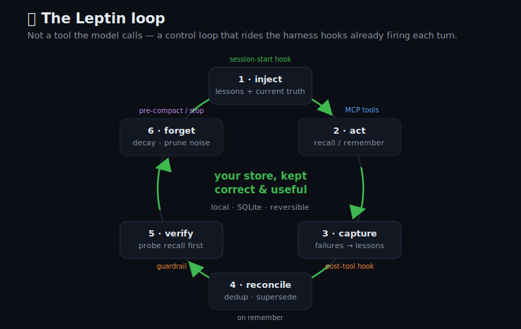
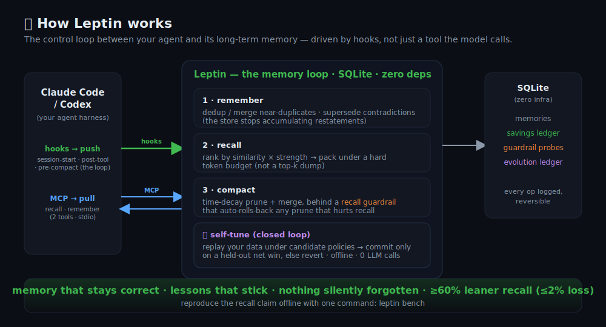

<div align="center">

# 🧬 Leptin

### Keep your coding agent's memory *correct* when decisions change.

**You switch `pnpm`→`bun`, change the deploy region, swap the auth scheme — and weeks later the agent is *still acting on the version you abandoned*. Leptin is a local-first control loop that keeps long-term memory correct over time: it runs on your agent's existing hooks to resolve contradictions so the *current* decision wins, make hard-won lessons stick, and — before it forgets anything — prove you can still recall what matters. It's not a store and not a compressor; it runs alongside whichever you use.**

[](https://github.com/lionellau/leptin/actions/workflows/ci.yml)
[](https://pypi.org/project/leptin-hlp/)
[](#install)
[](#design)
[](#testing)
[](LICENSE)

[See it in 30s](#see-it-in-30-seconds) · [Don't I already have this?](#wait--dont-i-already-have-this) · [Quickstart](#quickstart) · [How it works](#how-it-works) · [Who it's for](#who-leptin-is-for) · [Security](#security)



</div>

---

Persistent memory is supposed to make your agent smarter over time. Ungoverned, it does the opposite: it piles up **duplicates, stale facts, and contradictions**, so the agent goes *confidently wrong* — recommending the framework you dropped, the region you migrated off, the auth scheme you replaced — and repeats mistakes you already corrected. The usual fix, blind pruning, just trades one problem for another: you can't see what was dropped or get it back.

**Leptin is the loop that keeps memory _correct_ — not another place to put it.** It plugs into the hooks your agent already fires and, every session, resolves contradictions so the *current* truth wins, keeps your lessons-learned permanent, retires what's cold, and never forgets a thing without first **proving recall didn't regress**.

## See it in 30 seconds

```bash
pip install leptin-hlp && leptin demo      # runs in-memory; touches nothing on disk
```
```text
  ① The team is on pnpm — the agent recalls it correctly.
  ② You switch to bun:   remember("We use bun…")  →  superseded
  ③ Next session, the agent asks again:
       a naive store →  ['…bun', '…pnpm']     ← still serving the abandoned pnpm
       Leptin        →  ['…bun']              ← only the current truth
```
That's the whole product on one screen: **it keeps the current decision authoritative.** Want the measured version? `leptin bench` → a naive store serves the *outdated* fact **100%** of the time after a reversal; Leptin **0%**, at **0% recall loss**.

## "Wait — don't I already have this?"

Probably not the part that bites. Leptin sits on a **different axis** from a store or a compressor, and runs *alongside* them — not instead:

| You might assume… | The reality |
|---|---|
| "Isn't this just **dedup**?" | Dedup removes *copies*. Leptin decides which of two *conflicting* facts is current (`pnpm` vs `bun`) and retires the old one — reversibly, auditably. |
| "Doesn't my **context-compressor** (e.g. Headroom) cover it?" | Different job. A compressor shrinks what the agent reads *this turn*; Leptin keeps the *stored* facts consistent *over weeks*. They barely overlap — run both. |
| "Isn't this just another **store** (e.g. Mem0)?" | A store retrieves by similarity; it doesn't adjudicate which fact is *currently true* or prove a prune didn't cost you something. Leptin is the correctness loop you wrap around a store. |
| "Does it need an **API key / a service**?" | No. Local-first, zero core deps; offline for lexical/antonym/numeric reversals, hosted embeddings for semantic ones. Your DB stays a single local file. |

> The token footprint also drops ~65%, but we report that *honestly*: most of it is budget-packing (the axis a compressor also helps with); the **correctness loop is the part nothing else does**. Don't take our word — reproduce both numbers with `leptin bench`, and see the [honest offline limits](#design).

---

## Why I built this

> *(The origin story — the "why" behind the code.)*

I run coding agents all day on long-lived projects, with a persistent-memory MCP server so the agent stops re-learning my stack every session. It worked — until the store grew. Then `recall` started handing back a noisy pile of half-relevant, sometimes *contradictory* memories: a decision we'd reversed, a convention we'd dropped. The agent acted on the stale one. And it kept making the same mistakes across sessions because nothing made "we learned X the hard way" stick.

The ecosystem is good and moving fast — plenty of tools store, compress, and dedup memory well. What I couldn't find was the piece that keeps memory **correct over time**: resolve contradictions so the *current* truth wins, retire cold facts safely, keep lessons permanent, and prove a prune never cost me a fact I'd query later. So I built it, for the way I work — a solo dev on a local store I'd rather not migrate off of — and published it in case your setup looks like mine.

*— [@lionellau](https://github.com/lionellau). PRs, issues, and "this stopped my agent repeating X" stories welcome.*

---

## How it works

Leptin is a loop, not a tool the model calls. Each turn of your agent's harness fires it: **session-start** injects lessons + current truth, **post-tool** captures mistakes the moment they happen, **pre-compact / stop** runs the guarded prune. The loop spans **three layers** — and the model-facing one is deliberately tiny.

<div align="center">

</div>

> Why the loop, not just an MCP tool? An MCP server is *pull* — it works only when the model remembers to call it. Memory hygiene can't depend on that. Leptin runs on the harness's *push* points (hooks) so the discipline happens every loop whether or not the model asks. The MCP surface is just the two tools (`recall`/`remember`) the model genuinely needs in-band. See [docs/loops.md](docs/loops.md).

<div align="center">

</div>

1. **Discipline layer (hooks + CLI/daemon) — not model-callable.** Decay, dedup, supersede, the recall guardrail, and self-tuning run automatically through lifecycle hooks and a background CLI. They are *not* exposed as tools the model has to remember to call (tool schemas are a per-request token tax — eight of them is a standing cost for work the model should never invoke).
2. **Query layer (MCP) — lean.** Only **`recall`** and **`remember`** are exposed to the model by default. (Need the rest as tools? `LEPTIN_MCP_TOOLS=all`.)
3. **Human layer (CLI + dashboard).** Receipts (tokens & $ saved), the evolution/guardrail audit, `leptin doctor`, tuning.

The defining mechanisms:

- **Memory typing.** Every memory has a type with its own decay: `fact` (normal), `procedural` (slow), `task` (fades with the ticket), and **`lesson` — never decays.**
- **Lessons-learned, auto-injected.** Store an anti-pattern once (`leptin lesson "..."`); it's re-injected at **every session start** via a hook, so the agent stops repeating it. No tool call required.
- **Contradiction resolution (supersede), graded.** When a newer fact *confidently* contradicts an older one (a negation flip, an antonym, a single-slot value swap like `pnpm`→`bun`, or a numeric change on the same statement), the newer wins; the old is kept, marked superseded with a **reversible window**, and stays auditable (`leptin superseded`). Recall returns the *current* truth, not both. When the conflict is **uncertain** (a deeper paraphrase), Leptin does *not* bury either — it flags them for review (`leptin conflicts`) rather than silently coexisting or wrongly deleting a true fact. *(Offline this detector is lexical; semantic reversals need hosted embeddings.)*
- **Verified, transactional forgetting (the guardrail).** Before any prune commits, Leptin re-runs a probe set against the post-prune store *inside a transaction*; if recall would regress, the whole prune **rolls back**. Nothing is silently lost, and everything is reversible.
- **Provenance anchoring.** Anchor a memory to its source (`linear:ABC-123`, `spec:auth.md#flow`, `commit:sha`). When the source changes, `leptin stale <ref>` flags it — stale memories are down-weighted, not blindly trusted ("a fact is confidently wrong the moment its source changes").
- **Auto mistake-capture (the post-tool loop).** When a tool call fails (a bad command, a broken build), the post-tool hook distills it into a never-decaying lesson automatically — no one has to remember to write it down. Next session it's re-injected, so the agent doesn't walk into the same wall twice.
- **Recall-usefulness flywheel.** Leptin separates *recurrence* (needed again in a later session — a weak ranking tiebreaker) from *usefulness* (an explicit "it helped" via `leptin feedback`, or the `record_feedback` MCP tool). Useful memories are reinforced; a single **harmful** mark only down-weights (reversible by a later "useful") and takes two before it's flagged — so one noisy signal can't bury a fact. Cold, never-useful memories simply age out by decay; a strong, genuinely-used one is never mistaken for noise. The store gets *more* relevant with use, not just bigger.
- **Memory-health score.** `leptin health` grades the store 0–100 (A–D) on stale rate, noise rate, and harmful hits, and flags drift before recall quality rots — an at-a-glance read on whether the loop is keeping memory clean.
- **Budgeted, packed recall + savings ledger.** Recall is capped and packed for relevance; every op logs tokens (and $) saved vs. a naive top-k dump.

---

## Quickstart

### 1. Install
```bash
pip install leptin-hlp                 # once published to PyPI
pip install "git+https://github.com/lionellau/leptin"   # from source today
# optional hosted embeddings + LLM merge:
pip install "leptin-hlp[hosted]"
```

### 2. Wire it into Claude Code / Codex (hooks + lean MCP)
```bash
leptin connect claude-code     # prints the config: lifecycle hooks + the 2-tool MCP server
```
This installs the **discipline as hooks** (memory auto-injected at session start; compaction on stop) and exposes only `recall` + `remember` to the model.

### 3. Teach it a lesson, then watch the loop keep it correct
```bash
leptin lesson "Never run DB migrations on a Friday deploy."
# next session, that lesson is injected automatically — the agent won't repeat it
leptin remember "Auth uses JWT in cookies." --subject auth --source-ref spec:auth.md#tokens
leptin stale spec:auth.md#tokens     # when the spec changes, the memory is flagged
leptin feedback <id> --harmful       # close the loop: tell Leptin a recall misled the agent
leptin health                        # 0–100 score: is the loop keeping memory clean?
leptin dashboard                     # the receipts (tokens & $ saved, the audit trail)
```

<div align="center"></div>

---

## Who Leptin is for

**The beachhead: a developer (or small team) running a coding agent on one long-lived codebase for weeks.** That's where memory accumulates into hundreds of facts and where decisions *get reversed* — you switch `pnpm`→`bun`, move regions, change the auth scheme — and an ungoverned store keeps handing the agent the version you already abandoned. Leptin keeps the *current* decision authoritative and proves it never forgot what you still need. If that's you, this is built for you.

It also helps wherever memory **accumulates and gets queried a lot**:

- **Long-horizon research** — findings/sources pile up across sessions with updates and contradictions; Leptin keeps the knowledge base current and auditable.
- **Autonomous / looping / scheduled agents** — they write and recall constantly; verified pruning + never-decaying lessons keep memory from rotting or running away.
- **Small teams (2–10) working from specs + Linear tickets** — provenance anchoring ties memory to the ticket/spec so stale specs stop misleading the agent.

**You probably don't need Leptin if:** you do one-off Q&A / daily ops with no growing memory; your work fits a single session; or your store stays tiny.

---

## Where Leptin fits (vs / alongside other tools)

This isn't a teardown — the memory space is strong and these are good tools. Leptin sits on a **different axis**: most tools answer *"what do I store and how small can I make it?"* Leptin answers *"is what I'm storing still correct, and is it actually helping?"* — it's a control loop, not a store or a compressor, and it runs **alongside** them.

- **vs storage layers (Mem0, vector stores):** they store and retrieve by similarity — excellent at that. They don't adjudicate which conflicting fact is *currently true*, verify that a prune didn't cost you a fact, or learn which memories actually earned their place. Leptin is a **self-contained local store with that correctness loop built in**, and it runs *alongside* your existing one. *(A "governor mode" that drives the loop over an external store like Mem0/pgvector is on the roadmap — not shipped yet, so today Leptin governs its own SQLite.)*
- **vs context-compression layers (e.g. Headroom):** they shrink what the agent *reads each turn* (great at that) and keep everything. Leptin works on the other end — the long-term store's *correctness over time*: superseding stale truth, keeping lessons permanent, pruning proven-noise under a recall guardrail. Compress the stream **and** govern the store; they barely overlap.

If you need a managed, hosted memory platform, use one. Leptin is the small, local, auditable loop that keeps long-term memory **correct and useful** — and runs alongside whatever else you use.

---

## Design

- **Zero core dependencies** — engine, MCP server, hooks, guardrail, dashboard, benchmark, self-tuner all run on the Python stdlib. `pip install` is instant.
- **Offline by default, hosted by upgrade** — deterministic hashing embeddings + heuristic merge need no API key; `leptin-hlp[hosted]` adds OpenAI/Voyage embeddings + Claude/GPT merging (with retry + caching).
- **Glass box, reversible** — every merge/decay/forget/supersede/tune is logged with a reason; nothing is hard-deleted within the retention window; schema is versioned and migrates in place.

> **Honest limits (offline default).** The bundled hashing embedder is *lexical* — it matches near-identical text, not deep paraphrases. So offline, both **dedup** and **contradiction-supersede** fire on near-lexical / antonym / numeric reversals (`pnpm`→`bun`, `14 days`→`30 days`), and a semantic reversal (`"JWT in cookies"` → `"session tokens in headers"`) is **flagged for review**, not auto-resolved. Configure hosted embeddings (`leptin-hlp[hosted]`) for semantic dedup/supersede; verify the detector yourself with `leptin bench --eval-contradiction` (bundled set: precision 1.0, recall ~0.87, zero true facts buried). Defaults always err toward **keeping** data.

---

## Self-tuning (optional)

Leptin can tune its own policy on your data: it replays under candidate configs and commits a change only if held-out evals prove a net win, else reverts — offline, **zero LLM calls**, fully reversible (`leptin tune`). The guardrail's safety knobs are locked and never tuned.

---

## Security

Leptin is **local-first**: the MCP server speaks stdio (no network listener); the dashboard binds to 127.0.0.1 with a Host-header guard; memory content is data, never executed; hosted calls read keys from env, never stored; a user's memory DB is git-ignored (`*.db`/`*.sqlite`). Report vulnerabilities privately — see [SECURITY.md](SECURITY.md).

---

## Reproducible benchmark

```bash
leptin bench                      # correctness first, then footprint (offline, deterministic)
leptin bench --eval-contradiction # precision/recall/F1 of the contradiction detector
```
Two claims, both reproducible offline:

- **Correctness (the wedge):** after a decision is reversed, a naive store serves the **outdated** fact **100%** of the time; Leptin serves it **0%**, with **0% recall loss**.
- **Footprint:** ~**65% fewer recall tokens** than an unbudgeted top-k dump — but the bench *splits* this honestly into **~57% packing** (budget + relevance floor — the axis a context-compressor also helps with) **+ ~19% governance** (dedup/supersede/decay — the correctness loop). The packing number is not the wedge; the governance + correctness numbers are.

Run it on real [LoCoMo](https://snap-research.github.io/locomo/) with `--dataset locomo.json --embedding-model text-embedding-3-small` (semantic recall needs hosted embeddings; the bundled corpus is lexical).

---

## Testing

```bash
uv venv && uv pip install -e ".[dev]" && pytest
```
155 tests cover the graded contradiction detector (a labeled precision/recall set — zero true facts buried), the non-circular guardrail (verify the *fact*, not just the id), memory typing + never-decaying lessons, budgeted session-start injection, reversible + discoverable supersede, the reframed flywheel (recurrence ≠ usefulness; graded harmful feedback), the candidate-lesson policy, embedder provenance + recovery, the memory-health/conflicts surfaces, provenance/staleness, the hook entrypoint, the lean vs `all` MCP surface (incl. a real `leptin serve` subprocess), schema migrations, the savings ledger, self-tuning (deterministic split), the dashboard HTTP layer, hosted integration + retry/degradation, and the correctness + footprint benchmarks. CI runs the suite, the benchmark, a clean wheel install, and the TS build on Python 3.10–3.13.

---

## CLI

```bash
leptin demo                        # 60-second before/after: a reversed decision (no setup)
leptin connect claude-code|codex   # wire hooks + lean MCP
leptin serve   --db PATH           # MCP server (stdio)
leptin hook    <event>             # lifecycle-hook entrypoint (used by connect)
leptin lesson  "..."               # store a never-decaying lesson
leptin remember "..." [--type fact|procedural|task|lesson] [--source-ref REF]
leptin stale   <source-ref>        # flag memories whose source changed
leptin feedback <id>... [--harmful]  # close the loop: reinforce or down-weight a memory
leptin conflicts                   # possible contradictions flagged for review
leptin superseded                  # what got replaced, by what, and why (reversible)
leptin health                      # 0–100 memory-health score (stale / noise / harmful / conflicts)
leptin reembed                     # re-vectorise after a hosted→local fallback
leptin recall  "..." [--budget N]
leptin compact [--dry-run]    leptin tune [--dry-run|--rollback|--history]
leptin doctor   ·   leptin dashboard   ·   leptin report   ·   leptin bench
```

---

## Roadmap

**Shipped:** the full control loop on lifecycle hooks (Claude Code + Codex) · **graded contradiction-supersede** (confident → auto-resolve, uncertain → flag for review) with a labeled precision/recall eval · **non-circular recall guardrail** (verifies the fact, not just the id) · reversible + discoverable supersede · memory typing + never-decaying lessons · **bounded, demotable lessons** + gated auto mistake-capture · the **reframed flywheel** (recurrence ≠ usefulness; graded harmful feedback; `record_feedback` MCP tool) · **memory-health + conflicts** surfaces · embedder provenance + `reembed` recovery · provenance anchoring + staleness · the **correctness + footprint benchmark** (packing vs governance split) · lean MCP surface · self-tuning (deterministic) · local dashboard · `leptin doctor` · schema migrations · 155 tests + CI.

**Next (big bets):** a **governor mode** that runs the loop over an *external* store (Mem0 / pgvector) so you keep your backend — today Leptin governs its own SQLite · an **opt-in semantic offline path** (small local NLI/embedder) so paraphrase reversals resolve without a hosted key · a **`sqlite-vec` ANN fast path** + disk-backed scale-sweep bench for 10k–100k-row stores · more source adapters (Linear / GitHub / Jira) and host installers (Cursor, Gemini CLI).

---

## Contributing

PRs welcome — especially **source adapters** and **host installers**. See [CONTRIBUTING.md](CONTRIBUTING.md) and the [Code of Conduct](CODE_OF_CONDUCT.md). Keep the core dependency-free, add a test, and don't weaken the guardrail (its safety knobs stay locked).

## License

MIT — see [LICENSE](LICENSE).

<div align="center"><br/><i>If Leptin kept your agent's memory honest, a ⭐ helps others find it.</i></div>
